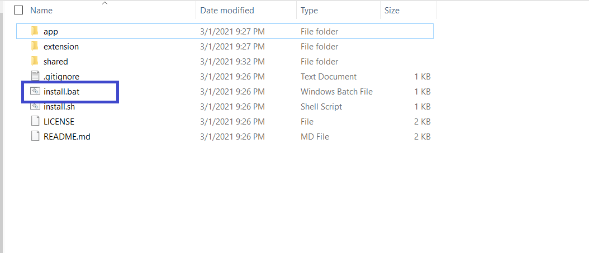
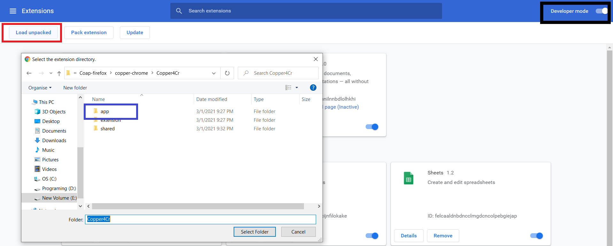
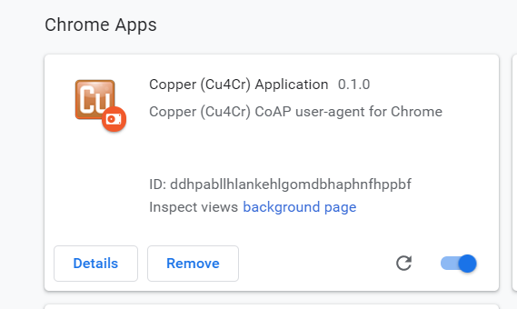
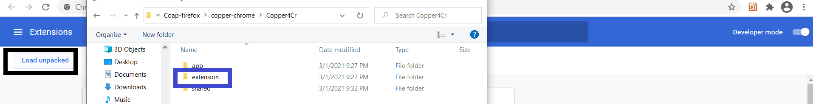
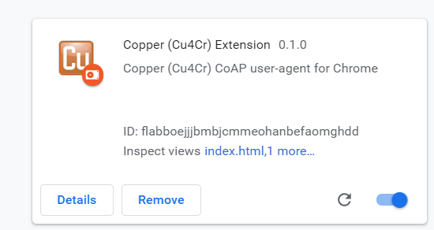
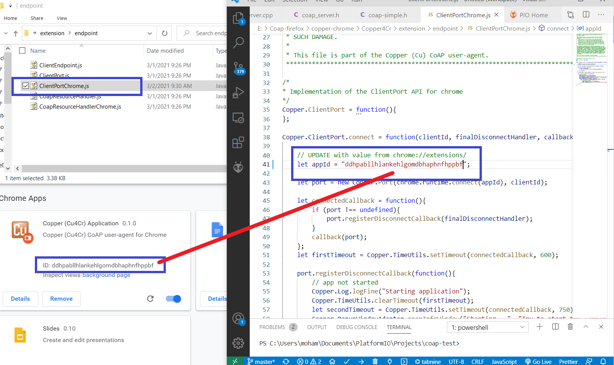
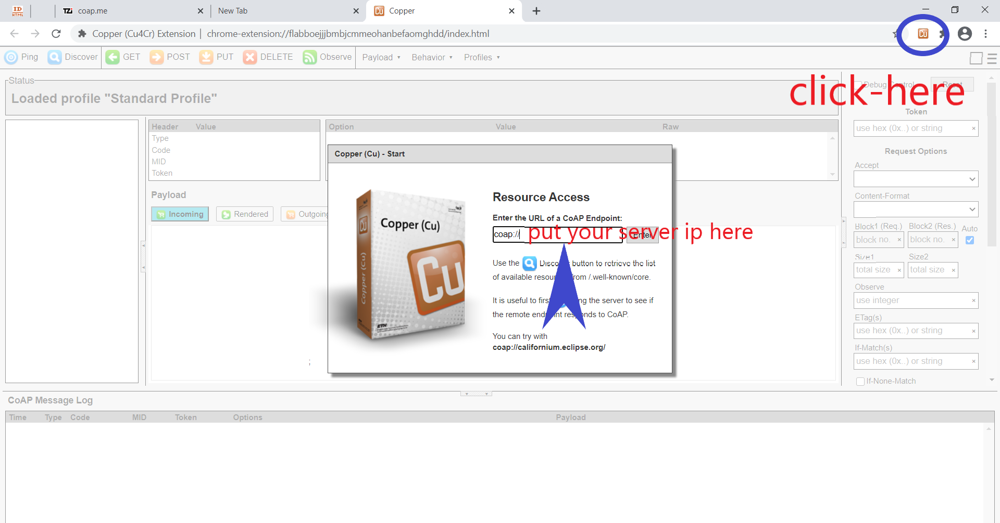
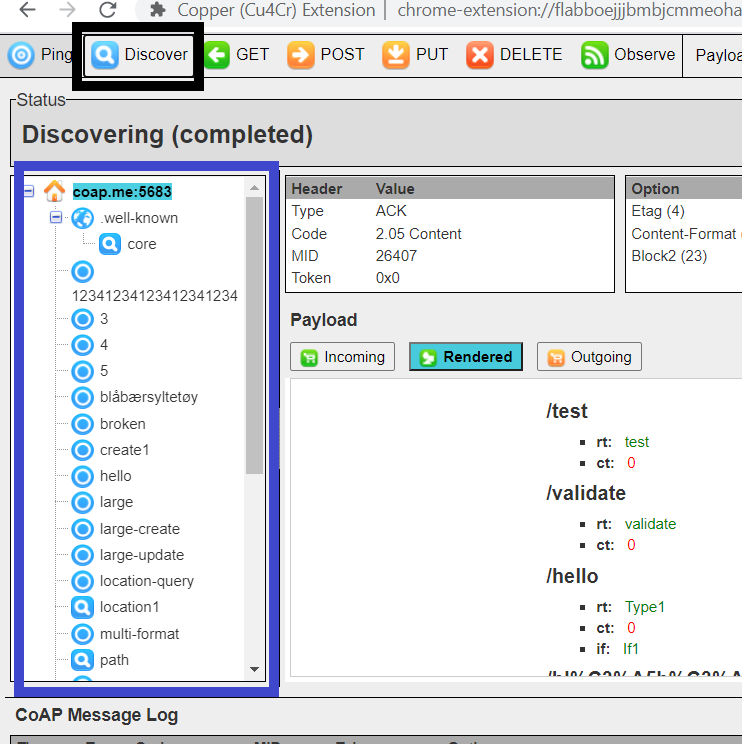

# Caop-server-extension-for-chrome
In this repository, you will find the extension folder with a tutorial about how you can install it and use it on chrome to test your work or code with COAP-server.

### Installing the Extension
1. Download the extension folder from the github-Link [Link1](https://github.com/mkovatsc/Copper4Cr) or [here-Link2](https://github.com/mohamadnoor991/Caop-server-extension-for-chrome).
2. Unzip the folder
3. Run install.bat (Windows) or install.sh (Linux) in the directory.

4. Open Chrome -> Setting -> Extensions -> Unable the developer mode
- - Press  Load unpackaged to load the <b>app</b> folder first then press it again to load the <b>extension</b> folder, in order it will appear in the extensions page.

- As result, you will find "Copper (Cu4Cr) Application" in the Chrome App panel.

5. Do the same steps for extension folder.

- In chrome extensions you will find this new extension. 

6.  Replace the appID in file .\extension\endpoint\ClientPortChrome.js to Copper (Cu4Cr) Application ID
- The path of the file is the same unzip path as the origin folder.
- The ID you want will find it in the chrome extensions page under the Chrome Apps panel "Copper (Cu4Cr) Application". 

7. Open the extension to test it (Restart your chrome if you could not see the extension icon).

### Test the Extension
- To check if your extension works put "coap://coap.me:5683" instead of server-IP in the open pop-window of the extension, Then press the Discover button you will find a list of endpoint url you can try it.

#### The main GitHub link of the folder is [Github-folder](https://github.com/mkovatsc/Copper4Cr) and another link I used to do my experiment is [help-link](http://wiki.dragino.com/index.php?title=Set_up_CoAP_Server).
#### I hope the previous note will save the copyright of the original authors.